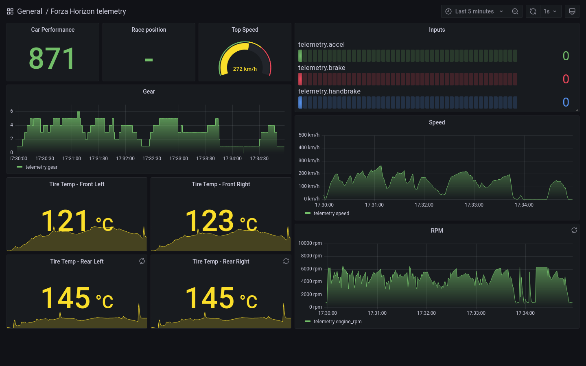

# Forza Horizon telemetry
Collect, store and display telemetry data from Forza Horizon.

## Based on the TICK stack
The TICK Stack is an acronym for a platform of open source tools formed by:
- Telegraf: a server agent for collecting and reporting metrics
- InfluxDB: high-performance time series database
- Chronograf: visualization of InfluxDB data
- Kapacitor: monitoring and alerting based on InfluxDB data

Kapacitor is not used for this project since there are no warnings to fire.

A python script is also necessary as a "proxy" to convert the udp datastream from the game into one
of the [supported telegraf input formats](https://github.com/influxdata/telegraf/blob/master/docs/DATA_FORMATS_INPUT.md)
(json in this case, may change in the future).

## Requirements
- a copy of Forza Horizon 4 or 5 (PC or XOne)
- docker and docker-compose

## How to use
1. clone this repository
2. run `docker-compose up`
3. enable data-out feature in game settings, pointing to the host that runs docker, port `9999`
4. open Chronograf in your browser at `localhost:8888` and setup the database connection:
    * Connection URL: `http://influxdb:8086`
    * Username: the `INFLUXDB_ADMIN_USER` in docker-compose.yml
    * Password: the `INFLUXDB_ADMIN_PASSWORD` in docker-compose.yml
    * Telegraf database name: `horizon`

## Roadmap / improvements
- split data in different InfluxDB measurements/tables
- ~~replace the external python script with a telegraf input plugin~~ (python container)
- make a telegraf aggregator plugin to compact data (game send 60 packets/seconds)
- make a telegraf processor plugin to manipulate data (ex. convert car_ordinal in car_model_name)
- try Grafana widgets and eventually replace Chronograf
- ~~add support for Forza Motorsport 7~~ (FM7 no longer included in Game Pass)
- ~~add support for Forza Horizon 5~~ (already works, FH5 uses the same format as FH4)

## References
- [Forza Motorsport 7 'Data Out' feature details](https://forums.forzamotorsport.net/turn10_postst128499_Forza-Motorsport-7--Data-Out--feature-details.aspx)
